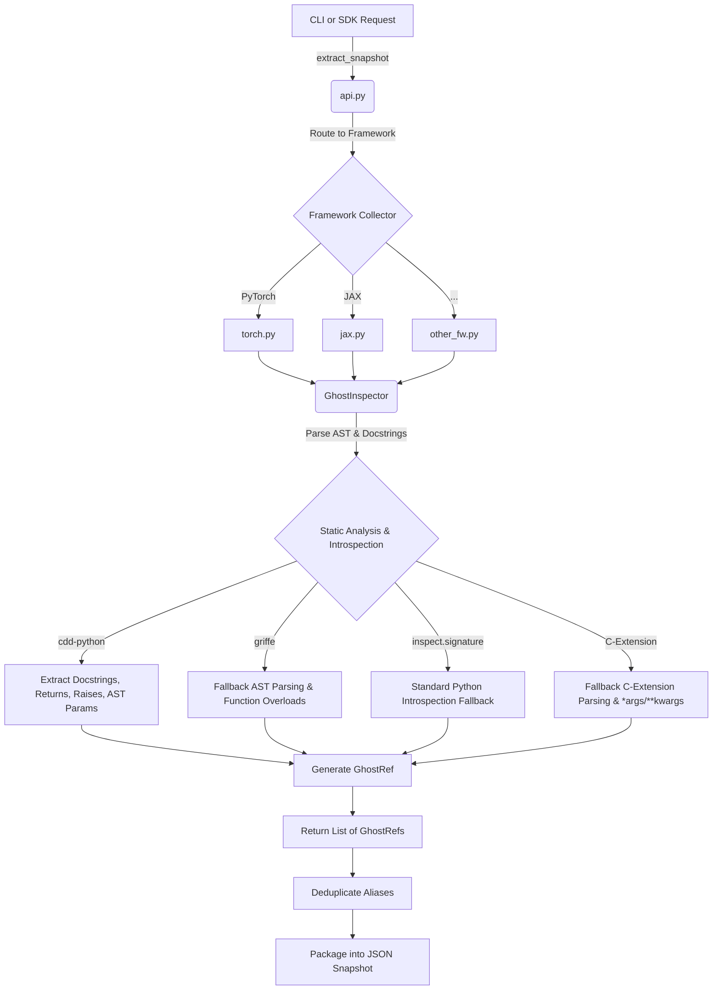

# Architecture

The `ml_framework_snapshots` library is engineered to solve a specific problem: **Introspecting dynamic, C-extension heavy Machine Learning frameworks safely and deterministically**, then serializing that structural data into a lightweight format that can be used anywhere.

## 1. Core Abstraction: The `GhostRef` (Ghost Protocol)

At the center of the architecture is the `GhostRef` model. Instead of relying on live Python objects (which hold memory allocations, file handles, or C++ pointers), we reduce every class and function into a static representation.

A `GhostRef` is a Pydantic V2 model defining:
- `name` and `api_path` (e.g. `Linear`, `torch.nn.Linear`)
- `kind` (`class` or `function`)
- `params`: A list of `GhostParam` objects, each capturing name, type hints, default values, kind (Positional, Keyword, VarArgs), and parsed docstring descriptions.
- `docstring`: The raw docstring.
- `returns_type` & `returns_description`: Extracted return information.
- `raises`: List of exceptions the function is documented to throw.
- `overloads`: If the function utilizes `@typing.overload`, an array of sub-signatures is maintained.
- `environment_tags`: Tags detailing runtime requirements (e.g., `cpu`, `cuda`).

By converting APIs into `GhostRef` arrays, the heavy ML library is no longer needed after the initial "capture" phase.

## 2. System Flow

The process of moving from a live module to a snapshot JSON is highly pipelined:

## 3. Resilience and Fallback Mechanisms

Machine learning frameworks are notoriously difficult to introspect due to complex metaclasses, decorators, JIT compilation (like `jax.jit` or `torch.compile`), and compiled bindings (PyBind11, Cython). The `GhostInspector` implements a multi-tiered fallback strategy:

1. **Decorator Unwrapping:** Before inspection begins, the target object is recursively unwrapped via common attributes like `__wrapped__`, `_original_fn`, `_orig_mod`, and `_python_function`.
2. **`cdd-python` (AST Parsing):** Parses the module AST to statically locate the object, bypassing dynamic metaclass interference. This layer accurately grabs docstring parameters, parameter defaults (converted to literals), and exceptions.
3. **`griffe` (Type Annotations & Overloads):** Used to supplement `cdd` by resolving complex PEP-585 / PEP-604 type hints, handling module-level `typing.overload` stacks, and properly identifying `VAR_POSITIONAL` (`*args`) kinds that other parsers might drop.
4. **`inspect.signature` (Runtime Fallback):** The standard Python library fallback for python-native functions if AST parsers fail.
5. **C-Extension Parsing:** Many operations (e.g., `torch.relu`) exist purely in compiled C++ layers and throw `ValueError` on `inspect.signature`. The system catches this and attempts to regex-parse the C-Extension docstring to synthetically recreate the Python signature. If all else fails, it defaults to a catch-all `(*args, **kwargs)`.
6. **Memory Address Scrubbing:** Default argument values can leak memory addresses (e.g., `<function mean at 0x1023a1a60>`). These are systematically scrubbed and replaced with `None` or `<unrepresentable>` to ensure deterministic JSON snapshots across different runs.

## 4. Advanced Pipelines

Once API data is in the JSON snapshot format, it unlocks a host of downstream architectural benefits:

### A. Diffing and Changelogs (`diff.py`)
Snapshots can be structurally compared. The diff engine flattens snapshots by their `api_path` and computes:
- `added`: APIs that didn't exist in the previous snapshot.
- `removed`: APIs that were deleted.
- `signature_changed`: APIs where parameter names, kinds, or critical defaults shifted. The engine can differentiate between **breaking changes** (e.g., adding a parameter without a default, changing a default value) and **non-breaking changes** (e.g., adding an optional `kwargs`).

### B. Type Stubs Generation (`stubs.py`)
Using the captured `GhostRef` structures, the system can regenerate complete `.pyi` type stubs. By filtering out unrepresentable defaults and utilizing standardized type aliases, the generated stubs provide IDEs with type-completion capabilities even when the framework isn't installed.

### C. Compliance Checking (`compliance.py`)
If a team is writing a new framework (e.g., a WASM wrapper for JAX), they can use `compliance.py` to statically verify their code. It extracts the target's API signatures, aligns them against a reference JSON snapshot, and assigns a coverage score, listing missing parameters or mismatched types.

### D. Schema Exporting (`export.py`)
To integrate ML APIs into varied ecosystems, snapshots can be directly trans-compiled into:
- **OpenAPI & JSON Schema**: Enabling standard web clients to interface with serialized ML logic.
- **Pydantic V2**: Allowing other Python services to strictly validate parameters being passed to an ML layer.
- **Protobuf**: For generating gRPC endpoints that map directly to the framework's native operations.
