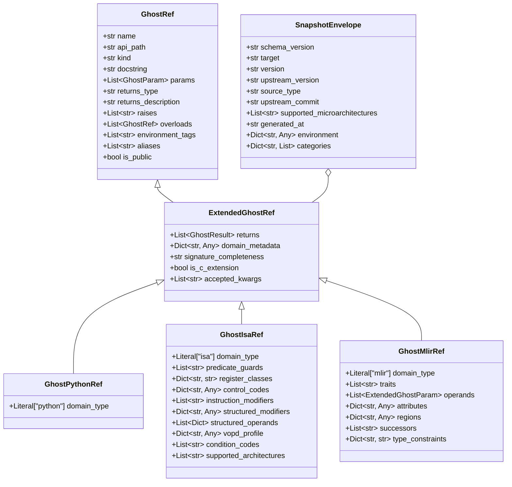
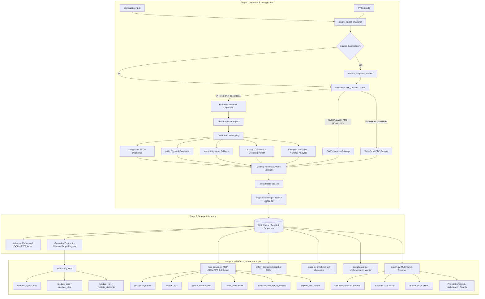

# Architecture

The `ml_framework_snapshots` library is engineered to solve a critical foundational problem: **Introspecting dynamic, C-extension heavy Machine Learning frameworks, compiler intermediate representations (IR), and hardware instruction set architectures (ISAs) safely, deterministically, and offline**, then serializing that structural data into lightweight, type-safe schemas that power anti-hallucination grounding engines, transpilers, IDE stubs, and Model Context Protocol (MCP) servers.

---

## 1. Core Abstraction: The Ghost Protocol & Domain-Specialized Models

At the center of the architecture is the **Ghost Protocol**. Instead of relying on live, heavyweight Python runtime objects (which allocate GPU memory, spawn driver contexts, lock C++ thread state, or depend on gigabyte-sized binary wheels), every framework API, compiler operation, and machine instruction is reduced into a static, serializable representation.

All models inherit from Pydantic V2 schemas defined in `ml_framework_snapshots.models` and `ml_switcheroo_ir.schema.ghost`.

```mermaid
classDiagram
    class GhostRef {
        +str name
        +str api_path
        +str kind
        +str docstring
        +List~GhostParam~ params
        +str returns_type
        +str returns_description
        +List~str~ raises
        +List~GhostRef~ overloads
        +List~str~ environment_tags
        +List~str~ aliases
        +bool is_public
    }

    class ExtendedGhostRef {
        +List~GhostResult~ returns
        +Dict~str, Any~ domain_metadata
        +str signature_completeness
        +bool is_c_extension
        +List~str~ accepted_kwargs
    }

    class GhostPythonRef {
        +Literal["python"] domain_type
    }

    class GhostIsaRef {
        +Literal["isa"] domain_type
        +List~str~ predicate_guards
        +Dict~str, str~ register_classes
        +Dict~str, Any~ control_codes
        +List~str~ instruction_modifiers
        +Dict~str, Any~ structured_modifiers
        +List~Dict~ structured_operands
        +Dict~str, Any~ vopd_profile
        +List~str~ condition_codes
        +List~str~ supported_architectures
    }

    class GhostMlirRef {
        +Literal["mlir"] domain_type
        +List~str~ traits
        +List~ExtendedGhostParam~ operands
        +Dict~str, Any~ attributes
        +Dict~str, Any~ regions
        +List~str~ successors
        +Dict~str, str~ type_constraints
    }

    class SnapshotEnvelope {
        +str schema_version
        +str target
        +str version
        +str upstream_version
        +str source_type
        +str upstream_commit
        +List~str~ supported_microarchitectures
        +str generated_at
        +Dict~str, Any~ environment
        +Dict~str, List~ categories
    }

    GhostRef <|-- ExtendedGhostRef
    ExtendedGhostRef <|-- GhostPythonRef
    ExtendedGhostRef <|-- GhostIsaRef
    ExtendedGhostRef <|-- GhostMlirRef
    SnapshotEnvelope o-- ExtendedGhostRef
```

### Core Data Models

- **`GhostParam` & `ExtendedGhostParam`**: Represents an individual parameter or operand. Extends standard Python parameter signatures with:
  - `direction`: `OperandDirection` (`READ`, `WRITE`, `READ_WRITE`, `PREDICATE`) for hardware instructions.
  - `role`: `IRParameterRole` (`OPERAND`, `ATTRIBUTE`, `RESULT`, `SUCCESSOR`, `REGION`) for compiler IRs.
  - `dtypes` & `allowed_dtypes`: Explicit lists of allowed tensor data types (e.g. `["float32", "bfloat16"]`).
  - `rank`: Expected tensor rank or dimensionality constraints.
  - `default`: Sanitized literal default value representation.
- **`GhostResult`**: Models structured SSA output returns for compiler IR operations (SSA result name, MLIR type like `tensor<?x?xf32>`, and description).
- **`ExtendedGhostRef`**: Adds first-class support for:
  - `returns`: List of `GhostResult` objects, supporting multi-result SSA operations.
  - `domain_metadata`: Structured dictionary holding domain-specific attributes (control code schedules, operand signatures, traits).
  - `signature_completeness`: Classification of signature certainty (`exact`, `heuristic`, or `opaque`).
  - `is_c_extension`: Flag identifying symbols originating from compiled C/C++ extensions.
  - `accepted_kwargs`: Explicit list of recognized keyword arguments extracted from function ASTs that accept generic `**kwargs`.
- **`GhostPythonRef` (`domain_type="python"`)**: High-level Python ML frameworks (PyTorch, JAX, TensorFlow, Keras, Flax NNX, HuggingFace, scikit-learn, etc.).
- **`GhostIsaRef` (`GhostInstructionRef`, `domain_type="isa"`)**: GPU assembly instruction sets (NVIDIA SASS, AMD RDNA/CDNA, NVIDIA PTX).
- **`GhostMlirRef` (`GhostOperationRef`, `domain_type="mlir"`)**: Compiler intermediate representations (Core MLIR dialects and StableHLO).
- **`SnapshotEnvelope`**: Provenance container capturing schema version (`2.0.0`), upstream commit hash, target version, microarchitecture capabilities, host build environment, generation timestamp, and categorized symbol maps.

---

## 2. End-to-End System Architecture

The system operates across three primary stages: **Extraction & Ingestion**, **Grounding & Verification**, and **Downstream Consumption**.

```mermaid
graph TD
    subgraph "Stage 1: Ingestion & Introspection"
        CLI[CLI: capture / pull] --> API[api.py: extract_snapshot]
        SDK[Python SDK] --> API

        API --> ISO{Isolated Subprocess?}
        ISO -->|Yes| PROC[extract_snapshot_isolated]
        ISO -->|No| REG[FRAMEWORK_COLLECTORS]

        PROC --> REG
        REG -->|PyTorch, JAX, TF, Keras...| PY_COL[Python Framework Collectors]
        REG -->|NVIDIA SASS, AMD RDNA, PTX| ISA_COL[ISA Exhaustive Catalogs]
        REG -->|StableHLO, Core MLIR| IR_COL[TableGen / ODS Parsers]

        PY_COL --> GI[GhostInspector.inspect]
        GI --> UNWRAP[Decorator Unwrapping]
        UNWRAP --> CDD[cdd-python: AST & Docstrings]
        UNWRAP --> GRIFFE[griffe: Types & Overloads]
        UNWRAP --> RUNTIME[inspect.signature Fallback]
        UNWRAP --> CEXT[utils.py: C-Extension Docstring Parser]
        UNWRAP --> KWVIS[KwargAccessVisitor: **kwargs Analysis]

        CDD --> SAN[Memory Address & Value Sanitizer]
        GRIFFE --> SAN
        RUNTIME --> SAN
        CEXT --> SAN
        KWVIS --> SAN

        ISA_COL --> SAN
        IR_COL --> SAN

        SAN --> DEDUP[_consolidate_aliases]
        DEDUP --> ENV[SnapshotEnvelope: JSON / JSON.GZ]
    end

    subgraph "Stage 2: Storage & Indexing"
        ENV --> DISK[(Disk Cache / Bundled Snapshots)]
        DISK --> FTS[index.py: Ephemeral SQLite FTS5 Index]
        DISK --> ENGINE[GroundingEngine: In-Memory Target Registry]
    end

    subgraph "Stage 3: Verification, Protocol & Export"
        ENGINE --> G_SDK[Grounding SDK]
        G_SDK --> V_PY[validate_python_call]
        G_SDK --> V_ISA[validate_sass / validate_rdna]
        G_SDK --> V_IR[validate_mlir / validate_stablehlo]

        DISK --> MCP[mcp_server.py: MCP JSON-RPC 2.0 Server]
        MCP --> T_SIG[get_api_signature]
        MCP --> T_SRCH[search_apis]
        MCP --> T_HAL[check_hallucination]
        MCP --> T_BLK[check_code_block]
        MCP --> T_TRANS[translate_concept_arguments]
        MCP --> T_EXP[explain_anti_pattern]

        DISK --> DIFF[diff.py: Semantic Snapshot Differ]
        DISK --> STUBS[stubs.py: Synthetic .pyi Generator]
        DISK --> COMP[compliance.py: Implementation Verifier]
        DISK --> EXP[export.py: Multi-Target Exporter]
        EXP --> EXP_JSON[JSON Schema & OpenAPI]
        EXP --> EXP_PYD[Pydantic V2 Classes]
        EXP --> EXP_PB[Protobuf v3 & gRPC]
        EXP --> EXP_LLM[Prompt Contexts & Hallucination Guards]
    end
```

---

## 3. Multi-Tiered Introspection & Static Analysis Pipeline

Introspecting modern ML libraries is complicated by heavy metaclasses, dynamically injected C++ operators, JIT decorators (`@torch.compile`, `@jax.jit`), and runtime-generated docstrings. The `GhostInspector` (`models.py`) and helper routines in `utils.py` execute an eight-tiered resolution strategy:

1. **Decorator Unwrapping:** Recursively unwrap nested wrapper objects up to 10 layers deep by checking `__wrapped__`, `_python_function` (TensorFlow), `_original_fn`, `__original_fn`, and `_orig_mod` (PyTorch Dynamo/Inductor).
2. **`cdd-python` Static AST Parsing:** Parses the module AST statically without importing dynamic metaclasses. Extracts structured docstring sections (`params`, `returns`, `raises`), converts parameter defaults into literal AST nodes, and validates Sphinx/reST documentation.
3. **`griffe` AST Engine:** Complements `cdd-python` by resolving complex PEP-585 / PEP-604 type annotations, resolving module-level `@typing.overload` stacks, and preserving `VAR_POSITIONAL` (`*args`) and `VAR_KEYWORD` (`**kwargs`) parameter roles across Google, NumPy, and Sphinx docstring conventions.
4. **`inspect.signature` Fallback:** Standard runtime reflection utilized for pure-Python functions when static AST parsing is inapplicable.
5. **C-Extension & PyBind11 Docstring Synthesizer (`utils.py:extract_c_extension_signature`):**
   - For compiled native functions (e.g. `torch.relu`, `aten::`, `c10::`) that raise `ValueError: no signature found for builtin`, docstrings are parsed with specialized regular expressions.
   - `_normalize_c_sig_args` translates C++ type syntax (e.g., `const Tensor & self, bool inplace=False`) into valid Python parameter signatures (`self: "Tensor" = False`) and unparses them into AST nodes.
   - Automatically handles numbered overload sets embedded in native docstrings.
6. **AST Keyword Visitor (`KwargAccessVisitor`):**
   - When a function signature ends with generic `**kwargs`, the inspector walks the AST of the function body.
   - It identifies all explicit accesses matching `kwargs.get("param")`, `kwargs["param"]`, and `kwargs.pop("param")`, exposing them via `accepted_kwargs` on `ExtendedGhostRef` to prevent false-positive hallucination reports.
7. **Memory Address Scrubbing & Factory Default Sanitization:**
   - Raw Python defaults often embed memory pointers (e.g., `<function mean at 0x1023a1a60>`, `<Device object at 0x7f...>`).
   - All defaults are processed through deterministic address scrubbing regexes: memory addresses are converted to `<addr>`, and unrepresentable runtime instances are mapped to `<factory_default>` or `<unrepresentable>` to ensure byte-identical snapshot serialization across machines.
8. **TableGen & Pre-Compiled Extraction Tools (`tools/`):**
   - For non-Python targets (SASS, RDNA, PTX, Core MLIR, StableHLO), offline scrapers parse LLVM TableGen (`.td`) definitions, CUDA Toolkit HTML/binary disassembly, and ODS specs into exhaustive local datasets (`*_exhaustive.json`).

---

## 4. Extraction Engine & Subprocess Isolation (`api.py`)

The extraction engine manages lifecycle, concurrency, and environment isolation during snapshot generation:

- **Dynamic Collector Discovery (`get_available_frameworks`):** Uses `pkgutil` and `importlib` to scan the `ml_framework_snapshots.frameworks` namespace, detecting all `collect_*` entry points and mapping canonical aliases.
- **Subprocess Isolation (`extract_snapshot_isolated`):**
  - High-performance ML libraries (PyTorch with CUDA, JAX with Metal, TensorFlow) often initialize non-resettable hardware driver states upon import.
  - `extract_snapshot_isolated` runs the collection logic in an isolated child Python process via `subprocess.run`. This guarantees that memory pre-allocation locks, C++ symbol collisions, and segmentation faults do not pollute or crash the parent process.
- **Concurrent Semantic Tier Processing:** Framework collection functions accept a `SemanticTier` filter (e.g. `CORE`, `TENSOR`, `NN`, `OPTIM`, `DISTRIBUTED`, `UTIL`). A `ThreadPoolExecutor` distributes tier extraction across threads.
- **Deterministic Alias Deduplication (`_consolidate_aliases`):**
  - Resolves duplicate functions exposed across multiple modules (e.g., `torch.add` vs `torch.Tensor.add`).
  - Converts parameter signatures into comparable tuples (including name, kind, default, annotation, direction, role, dtypes, and rank) and collapses duplicates, selecting the shortest canonical `api_path` as the primary reference while accumulating `aliases`.
- **Domain Metadata Hashing (`_domain_meta_to_key`):** Recursively converts arbitrary domain metadata dictionaries into deterministic sorted tuples for consistent deduplication.
- **Offline Mode (`is_offline_mode` / `ML_SNAPSHOTS_OFFLINE`):** Enforces purely local execution, bypassing remote network calls or version checks in air-gapped or sandboxed environments.

---

## 5. Hardware ISAs, Compiler Dialects, and Domain DSL Schemas

`ml-framework-snapshots` provides structured metadata schemas for low-level compilation backends, hardware architectures, and declarative DSLs:

### A. NVIDIA SASS Schema (`frameworks/nvidia_sass.py`)
- **Domain Type:** `GhostIsaRef` (`domain_type="isa"`)
- **Control Code & Scheduling Schema:** SASS instructions capture cycle-accurate scheduling metadata in `control_codes`:
  - `latency_ticks`: Latency cycles before destination registers become ready.
  - `yield_flag`: Warp yield control flag (`Y`).
  - `stall_count`: Cycle stall duration (0–15).
  - `read_barrier_mask` & `write_barrier_mask`: Scoreboarding dependency barrier tokens (0–5).
  - `register_reuse_flags`: Hardware register reuse cache flags (`R*.reuse`).
- **Microarchitectures:** Discrete tagging per NVIDIA compute capability: `["sm_70", "sm_75", "sm_80", "sm_86", "sm_89", "sm_90", "sm_100"]`. Uniform Registers (`UR`) are restricted to `sm_75+`, and asynchronous warpgroup matrix instructions (`WGMMA`) are restricted to Hopper+ (`sm_90+`).
- **Modifiers & Operands:** Instruction modifiers (e.g. `.SAT`, `.FTZ`, `.F16`) and structured operand records with explicit register classes.

### B. AMD RDNA / CDNA Schema (`frameworks/amd_rdna.py`)
- **Domain Type:** `GhostIsaRef` (`domain_type="isa"`)
- **Encoding Formats:** Models VOP1, VOP2, VOP3, VOP3P, VOPD (dual-issue), SOP1, SOP2, SOPK, SOPP, SMEM, and FLAT instruction profiles.
- **Modifiers:** Supports input negation (`-src`), absolute value (`|src|`), saturation (`clamp`), and output multipliers (`omod:2`, `omod:4`, `omod:div2`).
- **Register Alignment:** Enforces 32-bit `VGPR`, strictly even-aligned 64-bit pairs `V[n:n+1]`, 128-bit quads `V[n:n+3]`, and 256-bit matrix accumulator registers (`a[n:n+3]` on GFX9/CDNA).
- **Dual-Issue Profile (VOPD):** Captures opcode pairing rules and operand constraints for RDNA3/GFX11 and RDNA4/GFX12.

### C. NVIDIA PTX Schema (`frameworks/nvidia_ptx.py`)
- **Domain Type:** `GhostIsaRef` (`domain_type="isa"`)
- **State Spaces:** Models `.reg`, `.sreg`, `.const`, `.global`, `.local`, `.param`, and `.shared` memory spaces.
- **Types & Vector Widths:** Full support for bit types (`.b8`–`.b128`), unsigned/signed integers (`.u8`–`.u64`, `.s8`–`.s64`), standard floats (`.f16`, `.f32`, `.f64`, `.tf32`, `.bf16`), 8-bit floating point formats (`.e4m3`, `.e5m2`), and vector widths (`.v2`, `.v4`).
- **Scopes:** Memory visibility scopes (`.cta`, `.cluster`, `.gpu`, `.sys`).

### D. StableHLO Dialect Schema (`frameworks/stablehlo.py`)
- **Domain Type:** `GhostMlirRef` (`domain_type="mlir"`)
- **Structured Attribute Schemas:**
  - `DotDimensionNumbersAttr`: LHS/RHS batch and contracting dimension arrays.
  - `ConvDimensionNumbersAttr`: Input, kernel, and output spatial/feature dimensions.
  - `ScatterDimensionNumbersAttr` & `GatherDimensionNumbersAttr`: Window dimensions, batching dims, and index mappings.
  - `ComparisonDirectionAttr` & `PrecisionAttr`: Direction enums (`EQ`, `NE`, `GE`, `GT`, `LE`, `LT`) and precision modes (`DEFAULT`, `HIGH`, `HIGHEST`).
- **Regions & Block Arguments:** Enforces block argument signatures for control-flow and higher-order operations (`stablehlo.reduce`, `stablehlo.while`, `stablehlo.sort`).

### E. Core MLIR Dialects Schema (`frameworks/mlir.py`)
- **Domain Type:** `GhostMlirRef` (`domain_type="mlir"`)
- **TableGen ODS Source:** Parsed directly from LLVM TableGen definitions across 9 core dialects: `arith`, `math`, `tensor`, `linalg`, `scf`, `func`, `memref`, `gpu`, and `vector`.
- **Traits & Constraints:** Verification traits (`SameOperandsAndResultType`, `Commutative`) and ODS type constraints (`AnyTensor`, `RankedTensorOf`, `AnyFloat`, `Index`).

### F. Domain-Specific DSLs (`frameworks/html_dsl.py`, `latex_dsl.py`, `tikz.py`)
- Extends the Ghost protocol to declarative non-Python DSLs: standard HTML tags and attributes, LaTeX mathematical macros and environments, and TikZ graphical diagram primitives.

---

## 6. Anti-Hallucination Grounding SDK (`grounding/`)

The Grounding SDK provides programmatic, high-speed validation for LLM-generated code, transpilers, and compiler passes.

### Grounding Engine (`grounding/engine.py`)
- **In-Memory Registry:** Lazily loads and indexes symbol tables from bundled, cached, or custom directory paths.
- **Fuzzy Matching:** Implements Levenshtein distance calculations (`compute_levenshtein`) to suggest closest valid symbols when an invalid or hallucinated API is encountered.
- **Diagnostic System (`grounding/models.py`):** Returns structured `GroundingReport` objects populated with `GroundingDiagnostic` items categorized by `DiagnosticSeverity` (`ERROR`, `WARNING`, `INFO`), complete with actionable suggested fixes.

### Grounding Verifiers
- **Python Framework Call Verification (`validate_python_call`):**
  - Checks target symbol existence against offline snapshots.
  - Verifies positional argument count against parameter specifications.
  - Flags hallucinated keyword arguments.
  - Provides automated cross-framework translations (e.g. flagging `axis` in `torch.sum` and recommending `dim`).
- **Compiler IR Verification (`validate_stablehlo_op`, `validate_mlir_op`):**
  - Verifies SSA operand counts against dialect signatures.
  - Enforces mandatory attributes (e.g., requiring `dot_dimension_numbers` on `stablehlo.dot_general`).
- **Hardware ISA Verification (`validate_sass_instruction`, `validate_rdna_instruction`):**
  - Confirms instruction availability on the target microarchitecture (e.g., verifying `WGMMA` on `sm_90` or `v_dual_fmac` on `GFX11`).
  - Checks operand count, modifier validity, and register class alignments.

---

## 7. Model Context Protocol (MCP) Live Server (`mcp_server.py`)

The MCP server exposes the snapshot catalog to LLM coding agents, autonomous CLI tools, and IDE extensions via the JSON-RPC 2.0 Model Context Protocol standard over stdin/stdout.

### Exposed MCP Tool Catalog

| Tool Name | Purpose | Key Parameters |
|:---|:---|:---|
| `get_api_signature` | Retrieve ground-truth parameter types, defaults, and return specifications | `framework`, `api_path`, `version` |
| `search_apis` | Search operations and mnemonics by keyword or prefix | `framework`, `query`, `limit`, `version` |
| `check_hallucination` | Verify whether an API path or keyword arguments represent LLM hallucinations | `framework`, `api_path`, `kwargs`, `args_count`, `strict_kwargs` |
| `explain_anti_pattern` | Provide canonical migration advice and rationale for flagged anti-patterns | `framework`, `api_path`, `hallucinated_argument`, `passed_value` |
| `check_sass_instruction` | Validate SASS instruction legality, modifiers, and operands on target SM | `mnemonic`, `operands`, `modifiers`, `sm_arch`, `control_codes` |
| `check_rdna_instruction` | Validate AMD RDNA instruction legality on target GFX architecture | `mnemonic`, `operands`, `encoding`, `gfx_arch`, `modifiers`, `wave_size` |
| `check_ptx_instruction` | Validate PTX instruction, types, vector widths, and state space on SM | `mnemonic`, `types`, `operands`, `state_space`, `scope`, `sm_arch` |
| `check_mlir_op` | Validate MLIR dialect operation against ODS traits, operands, and attributes | `op_name`, `operands_count`, `attributes`, `operand_types`, `regions` |
| `check_stablehlo_op` | Validate StableHLO operation attributes and region constraints | `op_name`, `operands_count`, `attributes`, `structured_attributes` |
| `check_code_block` | Batch verify an entire code block for invalid APIs, kwargs, and hardware rules | `code`, `framework`, `version`, `sm_arch`, `gfx_arch` |
| `translate_concept_arguments` | Translate arguments across frameworks using concept parameter mapping schemas | `concept`, `source_framework`, `target_framework`, `source_kwargs` |

### Concept Argument Translation
Translates semantic parameters between frameworks (e.g. converting `dim` to `axis`, or adjusting `keepdim`/`keepdims` when migrating operations like `reduce_sum`, `matmul`, `softmax`, or `convolution` between PyTorch, JAX, NumPy, TensorFlow, and StableHLO).

---

## 8. Downstream Generation & Integration Pipelines

Captured snapshots power five downstream code and schema generation workflows:

### A. Semantic Snapshot Diffing (`diff.py`)
Computes fine-grained differences between framework snapshots:
- **`added` / `removed`**: Additions and deletions of API paths.
- **`signature_changed`**: Changes in parameter names, order, types, or default values.
- **Breaking vs. Non-Breaking Classification**: Distinguishes breaking changes (e.g., adding mandatory arguments, altering default values, removing instruction modifiers, dropping microarchitecture support) from non-breaking changes (e.g., adding optional parameters with defaults).
- **Changelog Generation (`generate_changelog`)**: Emits structured Markdown changelogs suitable for release notes.

### B. Type Stub Generation (`stubs.py`)
Generates PEP-484 `.pyi` type stub files directly from snapshots:
- Rebuilds module hierarchies, class definitions, method signatures, and function overloads.
- Strips unrepresentable default values while preserving static type hints, enabling IDE autocompletion for frameworks without requiring the native framework wheels to be installed.

### C. Static Compliance Engine (`compliance.py`)
Enables cleanroom verification of third-party framework implementations (e.g. custom WebAssembly runtimes or mobile shims):
- Compares a candidate library's runtime signatures against reference snapshots.
- Emits compliance scores, categorizing missing symbols, signature mismatches, and parameter discrepancies.

### D. Multi-Target Schema Exporting (`export.py`)
Trans-compiles snapshots into diverse industry-standard interface definitions:
- **JSON Schema & OpenAPI Specifications**: Via `cdd-python`, generating web service API schemas and REST route definitions.
- **Pydantic V2 Models**: Synthesizes type-safe Pydantic classes with support for overloaded variants (`typing.Union`) and variable argument validation (`Tuple[Any, ...]`).
- **Protobuf v3 & gRPC Definitions**: Generates `.proto` message definitions, standardized enums (e.g. `ReductionType`, `PaddingMode`, `LayoutMode`, `InterpolationMode`), `TensorProto` definitions, and gRPC service signatures.
- **LLM Prompt Context Exporters**:
  - `export_llm_prompt_context`: Compact Markdown specifications with parameter constraints.
  - `export_sass_prompt_context`: Canonical SASS assembly templates specifying valid register files, modifiers, and SM capabilities.
  - `export_mlir_prompt_context`: Canonical MLIR SSA syntax templates separating runtime operands from compile-time attributes and regions.
  - `export_scoped_prompt_context`: Hierarchical summary index with `COMMON_HALLUCINATION_GUARDS` to prevent context window explosion.

---

## 9. Ephemeral Local SQLite FTS5 Index & Cache (`index.py`)

To achieve sub-millisecond symbol lookups without loading multi-megabyte JSON trees into memory:
- **SQLite FTS5 Full-Text Index (`get_index_db_path`)**: Automatically creates an ephemeral search database in the user's platform-specific cache directory (`XDG_CACHE_HOME` / `~/.cache/ml_framework_snapshots/index.db`).
- **Incremental Indexing**: Uses SHA-256 file hashes (`compute_file_sha256`) to incrementally index bundled and cached JSON snapshots.
- **Integrity Verification**: CLI commands (`verify-local-cache`) validate local cached snapshot files against upstream cryptographic checksums.

---

## 10. CLI Architecture & Path Resolution (`cli.py`)

The command-line interface provides the user-facing entrypoint for snapshot capture, inspection, and verification.

### Multi-Tier Snapshot Path Resolution (`resolve_snapshot_path`)
Resolves snapshot identifiers (e.g. `torch`, `torch_v2.4.0.json`, or custom paths) across a cascading hierarchy:
1. Exact file path or `.json` suffix.
2. Custom paths defined in `ML_SNAPSHOTS_PATH` or `ML_FRAMEWORK_SNAPSHOTS_PATH`.
3. Local cache directory (`~/.cache/ml_framework_snapshots/snapshots`).
4. Project repository root `snapshots/`.
5. Package-bundled `src/ml_framework_snapshots/snapshots/` and `frameworks/`.
6. Current working directory `snapshots/`.

### CLI Subcommands Overview

| Command | Purpose |
|:---|:---|
| `capture` | Introspect installed frameworks and write JSON snapshots |
| `diff` | Compare two snapshots and generate breaking/non-breaking changelogs |
| `generate-stubs` | Synthesize `.pyi` type stubs from a snapshot |
| `export` | Export snapshot to OpenAPI, JSON Schema, Pydantic V2, or Protobuf |
| `mcp` | Launch the Model Context Protocol JSON-RPC tool server |
| `check` | Verify compliance of a target implementation against a reference snapshot |
| `list-snapshots` | List bundled and cached framework snapshots |
| `pull` | Download an official snapshot asset from GitHub Releases into local cache |
| `download-all` | Download all canonical pre-compiled snapshots into cache |
| `verify-local-cache` | Verify SHA-256 integrity of all cached snapshots |
| `index` | Inspect or rebuild the local SQLite FTS5 search index |
| `index-cache` | Clean or optimize the SQLite index database |
| `check-sass` | Validate NVIDIA SASS assembly instructions, modifiers, and SM architectures |
| `check-rdna` | Validate AMD RDNA assembly instructions, encodings, and GFX generations |
| `check-mlir` | Validate MLIR dialect operations and traits |
| `check-stablehlo` | Validate StableHLO operations, dimension numbers, and block regions |
